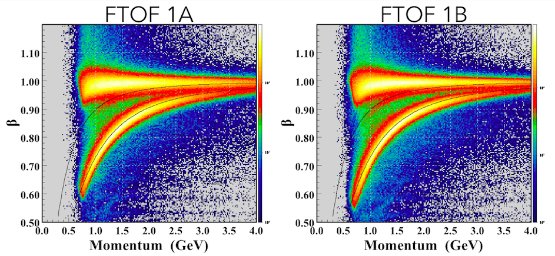
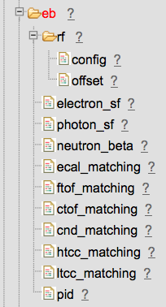

# Event Builder

## Table of Contents
* [Overview](#overview)
* [Output Banks](#output-banks)
* [Beam Helicity](#beam-helicity)
* [Beam Radio Frequency](#beam-radio-frequency)
* [Particle Creation](#particle-creation)
  + [Charged Particles](#charged-particles)
  + [Neutral Particles](#neutral-particles)
    - [Forward](#forward)
    - [Central](#central)
  + [Forward Tagger](#forward-tagger)
* [Event Start Time](#event-start-time)
* [Particle Identification](#particle-identification)
  + [Electron/Positron](#electron-positron)
  + [Charged Hadrons](#charged-hadrons)
    - [Cherenkov Vetoes](#cherenkov-vetoes)
  + [Neutrals](#neutrals)
    - [Forward Detector](#forward-detector)
    - [Central Detector](#central-detector)
    - [Forward Tagger](#forward-tagger-1)
  + [RICH](#rich)
* [CLAS Calibration Database](#clas-calibration-database)
  + [ECAL Sampling Fraction Parameterization](#ecal-sampling-fraction-parameterization)

## Overview
The roles of the Event Builder are:

-   Collect and analyze global event information, e.g. RF, helicity,
    scalers.
-   Collect and organize reconstructed responses from the various CLAS12
    detector subsystems.
-   Associate those responses into particles and execute particle
    identification schemes.
-   Output all necessary information for physics analyses into dedicated
    data structures.

## Output Banks
The output data structures of the Event Builder are HIPO banks whose
names are prefixed with "REC". These banks comprise what is commonly,
historically called DSTs, or Data Summary Tapes. The true, full
structure of each bank is always contained in the
[event.json](../../etc/bankdefs/hipo4/event.json)
file in the offline software repository. Here's the bank listing, and
for more details on their relationships and contents see [CLAS12
DSTs](doc/dst.md).

-   REC::Event
-   REC::Particle
-   REC::Calorimeter
-   REC::Scintillator
-   REC::Cherenkov
-   REC::Track
-   REC::Traj (track trajectory)
-   REC::CovMat (track covariance matrix)
-   REC::VertDoca (multi-particle vertices, currently unused)

## Beam Helicity
The Event Builder currently only supports direct (not delayed) reporting
of beam helicity, which is appropriate for all CLAS12 data prior to the
Fall 2018 run. The square-wave helicity signal is readout via an FADC250
module, and the helicity state for a given event is assigned binarily
based on the readout FADC waveform for that event. The result is stored
in `REC::Event.helicity` with a value of -1/+1 for the two helicity
states, while anything else is an invalid/unknown state. See the [DST
documentation](doc/dst.md) for information on delayed
helicity.

## Beam Radio Frequency
The Event Builder analyzes the raw RF pulses and reports the RF time for
each event in `REC::Event.RFTime`. The raw RF pulses are downsampled by
80X, and duplicated for redundancy, in hardware before readout, and the
configuration and choice of signal is determined by parameters in CCDB.

This information is also later used by the Event Builder to assign an
RF-corrected event start time (see below) and output in
`REC::Event.startTime`.

## Particle Creation
The creation of particles is performed in two stages, corresponding to
charged and neutral particles.

### Charged Particles
For each reconstructed track, from either the central (CVT) or forward
(DC) tracking systems, one corresponding charged particle is created.

-   For each track, association with the responses of non-tracking
    detectors is then performed.
    -   This association is currently based only on loose geometric
        matching with fixed windows, where those cut windows are store
        in CCDB.
    -   This geometric matching is performed based on the distance of
        closest approach between the detector response and the track.

### Neutral Particles
After charged particles are assimilated, calorimeter responses
(EC/PCAL/CND) that remain unassociated to any existing particle are then
assimilated into neutral particles.

#### Forward
For forward detectors, the algorithm is as follows:

1.  PCAL clusters unassociated with any DC track are assigned as new
    neutrals particles.
    -   EC Inner and Outer clusters are then geometrically associated to
        those PCAL seeds assuming a straight line trajectory form CLAS12
        origin.
2.  Remaining unassociated EC Inner clusters are assigned as new neutral
    particles.
    -   EC Outer are then geometrically associated to those EC Inner
        seeds, again assuming a straight line trajectory form CLAS12
        origin.
3.  Remaining unassociated EC Outer clusters are assigned as new neutral
    particles.

#### Central
Central detectors are treated similarly as forward, with CND clusters
unassociated with a CVT track as the seed, and unmatched CTOF hits then
associated.

### Forward Tagger
The Forward Tagger's reconstruction and particle identification is
currently performed upstream of the Event Builder, in FT's
reconstruction engine, and is just imported by the Event Builder and
output in the REC banks. This assigns only two possible particle
identifications, photon (22) or electron (11), since the Forward Tagger
can only distinguish neutral from charged (based on hodoscope response).
Charged/neutral particles are just assumed to be electrons/photons.

## Event Start Time
The event start time is chosen based on the RF signal and the "best"
detected particle and output in `REC::Event.startTime`. Currently this
particle must have both

1.  a track in the DC
2.  an associated FTOF hit in panel 1B (preferred) or 1A

Priority is then ordered as e-, e+, π+,
π-. In each case, if multiple candidates exist, the one with
the highest momentum is taken. For e+/e- the
ECAL/HTCC criteria discussed in the next section is required, but for
pions there are no additional requirements (i.e. it's just assumed to be
a pion).

This one start time particle is always located in the first row in
`REC::Particle` and its particle identification assigned accordingly in
`REC::Particle.pid` (independently of the identification algorithm
discussed in the next section).

*Note, if no particle satisfying any of the above criteria exists in the
event, the start time is assigned as -1000 (and in general non-positive
start times are the sign of a bad event). In that case, particle
identification generally cannot be reliably performed.*

## Particle Identification
The variable `REC::Particle.pid` contains the particle identification
assignment from the Event Builder, and `REC::Particle.chi2pid` contains
a quality factor for that assignment.

### Electron/Positron
For charged particles in the forward detectors, the Event Builder first
assigns e-/e+ (11/-11) if a particle satisfies all
corresponding HTCC and ECAL requirements (and has an associated FTOF
hit):

1.  2.0 photoelectrons in HTCC
2.  60 MeV in PCAL
3.  5-sigma cuts on a parameterized momentum-dependent sampling fraction
    -   where "sampling fraction" is ECAL visible energy deposition
        (PCAL+Inner+Outer) divided by momentum [see details on the parameterization](#ECAL-Sampling-Fraction-Parameterization)

These parameters are stored in CCDB, and the variable
`REC::Particle.chi2pid` is assigned as the number of σ from the expected
sampling fraction.

### Charged Hadrons
For charged particles with an associated TOF hit that do not satisfy
e+/e- criteria nor were the start time particle,
the Event Builder assigns d/p/K/π (45/2212/321/211), including both
charge states for the last three. This is based purely on minimizing the
difference between its vertex time and the event start time (plus
possible overrides for Cherenkov vetoes).

Currently only one timing response is used for this, and for cases when
multiple FTOF panels are associated with the same track, prioritization
is:

1.  FTOF 1B
2.  FTOF 1A
3.  FTOF 2

In the central detector, only one CTOF response can be associated and no
prioritization necessary.

The variable `REC::Particle.chi2pid` is assigned as the number of σ from
the expected vertex time for the best hypothesis, i.e. Δt/σ.

Below is an example of FTOF performance as of May 8, 2018, run 3432, 50
nA, electron inbending, software version 5b.3.3, where the black lines
represent the expected curves for protons and kaons. The Event Builder's
timing cuts are effectively halfway between these theoretical curves,
and tightening those cuts can be achieved with `REC::Particle.chi2pid`.

<figure>
<figcaption aria-hidden="true">ftof-bvsp-May2018a.png</figcaption>
</figure>

#### Cherenkov Vetoes
The Event Builder currently allows overrides to the timing measurements
above based on the HTCC and LTCC threshold Cherenkov detectors. If the
particle registers at least 2 photoelectrons in a corresponding
Cherenkov detector and it's momentum is above pion threshold in that
detector, then it is assigned as a pion.

### Neutrals
For neutrals, the variable `REC::Particle.chi2pid` is currently left
**unassigned**. Also, if particle identification cannot be assigned, the
momentum vector is assigned a magnitude of zero.

#### Forward Detector
Only photon (22) and neutron (2112) are considered. Particles are first
seeded by unassociated PCAL clusters, then matched to Inner/Outer
clusters, then seeded on remaining Inner clusters and matched to Outer,
and finally seeded on remaining unassociated Outer clusters.
Photon/neutron assignment is based on simple beta cut at 0.9 (from
CCDB), and, as of COATJAVA 8.6.0, a neutron veto if there's no PCAL
response. Currently only one timing response is used for this, and the
prioritization is:

1.  PCAL
2.  EC Inner
3.  EC Outer

The momentum direction is assigned based on the neutral's ECAL cluster
position and the vertex of the charged particle used to determine the
start time. For photons, the energy (magnitude of the momentum) is
calculated from ECAL visible energy and momentum-dependent sampling
fraction, while for neutrons energy is calculated from beta.

*Note, if beta is invalid (i.e. less than zero, out of time), than the
neutron's momentum vector is assigned a magnitude of zero.*

#### Central Detector
For the central detector, CND/CTOF is treated the same as ECAL/FTOF,
except only neutron pid is assigned and the beta cut is at 0.8.

#### Forward Tagger
Neutrals in the tagger are all assigned as a photon.

### RICH
*Not yet included in Event Builder, pending RICH reconstruction.*

## CLAS Calibration Database
The Event Builder stores almost all its parameters in CCDB, under
`calibration/eb`. These parameters are retrieved at runtime based on the
run number found in the `RUN::config` bank and interpreted and stored in
the class EBCCDBConstants. The structure of the database can be
navigated at [this
website](https://clasweb.jlab.org/cgi-bin/ccdb/objects). Here's an image
of the Event Builder's table layout in CCDB:

### ECAL Sampling Fraction Parameterization
The parameterization used by the Event Builder for ECAL's sampling
fraction's mean (and sigma) is

*S* = *p*1 × (*p*2+*p*3/*E*+*p*4/*E*2),

where *E* is measured, visible energy in the calorimeter and *S* is
sampling fraction (i.e. corrected energy is *E*/*S*).

The parameters *p**i* (named "sf#" in CCDB) are stored in the
tables
[`electron_sf`](https://clasweb.jlab.org/cgi-bin/ccdb/versions?table=/calibration/eb/electron_sf)
and
[`photon_sf`](https://clasweb.jlab.org/cgi-bin/ccdb/versions?table=/calibration/eb/photon_sf).
The resolution on sampling fraction is parameterized with the same
functional form, replacing *S* with *σ* (and the "sfs#" parameters in
CCDB).

*Note, the sector=0 row in CCDB in these tables is for backward
compatibility with older software versions and currently unused.*
